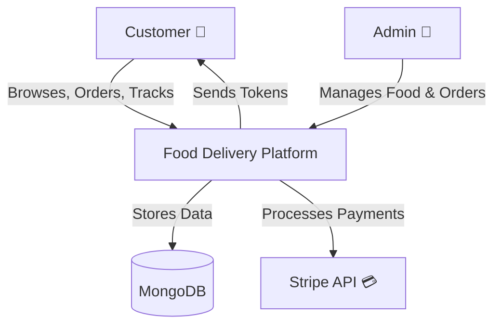
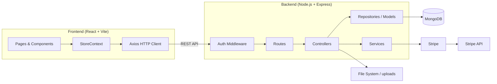
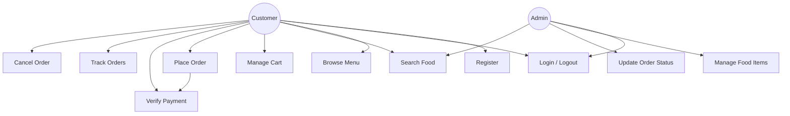
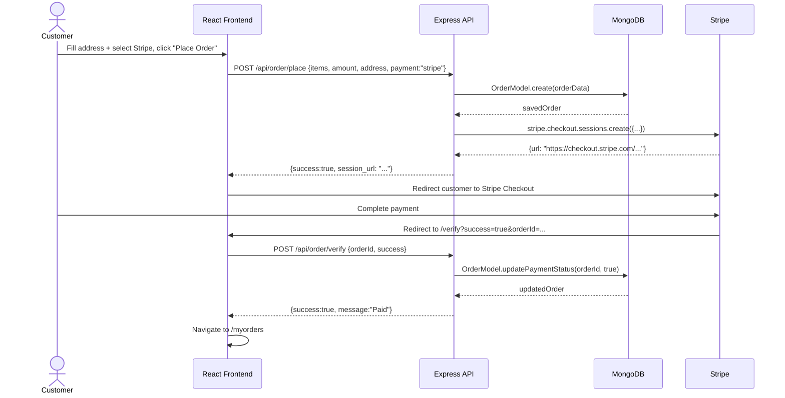
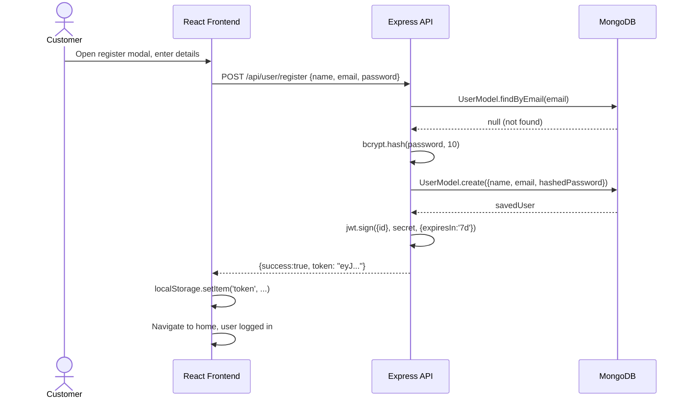
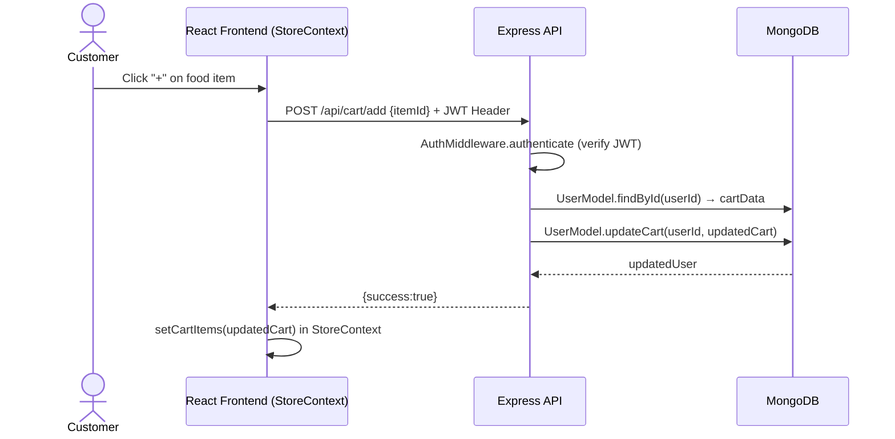
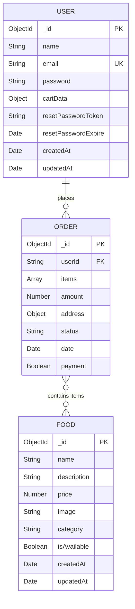
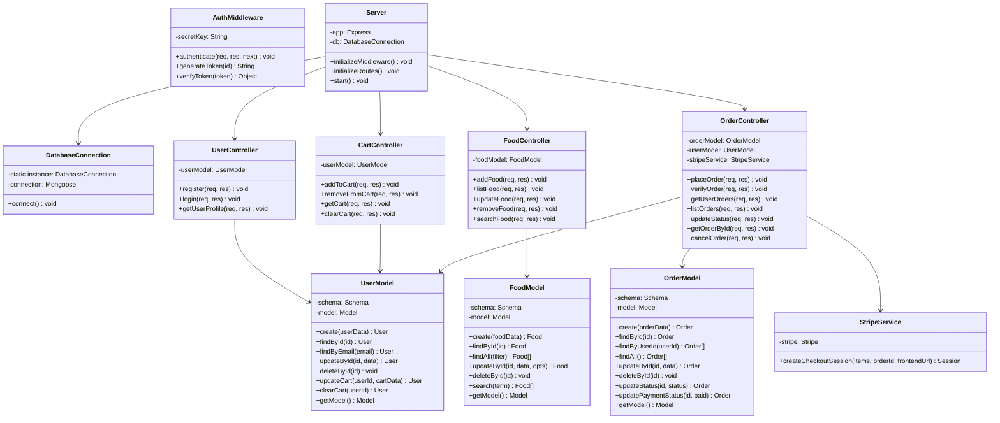
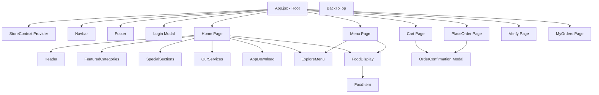
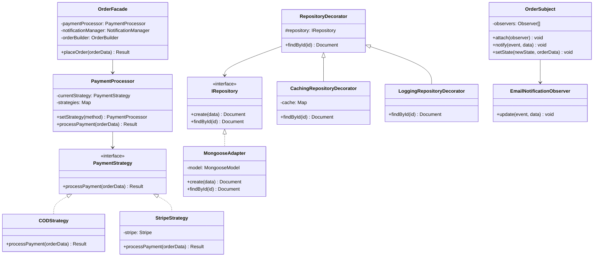

# Food Delivery Platform — Project Report

---

## Table of Contents

1. [Introduction](#1-introduction)
2. [User Stories](#2-user-stories)
3. [Use Cases](#3-use-cases)
4. [Use Case and User Story Mapping](#4-use-case-and-user-story-mapping)
5. [Acceptance Criteria](#5-acceptance-criteria)
6. [Diagrams](#6-diagrams)
7. [Database Design](#7-database-design)
8. [Class Design](#8-class-design)
9. [Implementation](#9-implementation)
10. [Backend Implementation](#10-backend-implementation)
11. [Design Patterns Implemented and Feasibility](#11-design-patterns-implemented-and-feasibility)
12. [UI/GUI Design](#12-uigui-design)

---

## 1. Introduction

### 1.1 Project Overview

The **Food Delivery Platform** is a full-stack web application that connects customers with food vendors, enabling users to browse menus, add items to a shopping cart, place orders, and track delivery status in real time. The platform also includes an administration interface for managing food listings and processing orders.

### 1.2 Purpose and Scope

The purpose of this project is to deliver a production-ready, scalable food-ordering system that demonstrates:

- Clean software architecture following **Object-Oriented Programming (OOP)** principles.
- Application of well-known **software design patterns** to solve recurring engineering problems.
- A seamless and responsive **user experience** built with modern frontend technologies.
- Secure, token-based **authentication** and integrated **payment processing**.

The scope covers:

| Area | Details |
|------|---------|
| Customer-facing portal | Browse, search, cart management, checkout, order tracking |
| Admin panel | Food CRUD, order management, status updates |
| Backend API | RESTful endpoints for all operations |
| Database | MongoDB persistent storage |
| Payment | Stripe online payments and Cash on Delivery (COD) |

### 1.3 Technology Stack

| Layer | Technology |
|-------|-----------|
| Frontend | React 18, Vite, React Router v6, Framer Motion, Axios, React Toastify |
| Backend | Node.js, Express.js, ES Modules |
| Database | MongoDB, Mongoose ODM |
| Authentication | JSON Web Tokens (JWT), bcryptjs |
| Payment | Stripe Checkout Sessions |
| Image Upload | Multer (multipart/form-data) |
| State Management | React Context API |

### 1.4 Project Goals

1. Allow customers to register, browse a food menu, manage a shopping cart, and place orders.
2. Support multiple payment methods: Stripe and Cash on Delivery.
3. Allow administrators to add, update, search, and remove food items, and manage order statuses.
4. Implement OOP best practices (encapsulation, inheritance, polymorphism, abstraction).
5. Demonstrate at least eight distinct software design patterns in the codebase.
6. Provide a visually engaging, mobile-responsive UI with smooth animations.

---

## 2. User Stories

User stories are written from the perspective of the system's actors: **Customer**, **Admin**, and **System**.

### 2.1 Customer Stories

| ID | As a… | I want to… | So that… | Priority |
|----|-------|-----------|---------|---------|
| US-01 | Customer | Register for an account with my name, email, and password | I can log in and save my preferences | High |
| US-02 | Customer | Log in using my email and password | I can access my profile and order history | High |
| US-03 | Customer | Browse all available food items on the menu | I can decide what to order | High |
| US-04 | Customer | Filter food items by category | I can quickly find what I am looking for | High |
| US-05 | Customer | Search for food items by name, description, or category | I can locate specific dishes efficiently | Medium |
| US-06 | Customer | View details of a food item (price, description, image) | I can make an informed purchase decision | High |
| US-07 | Customer | Add items to my shopping cart | I can collect multiple dishes before checking out | High |
| US-08 | Customer | Increase or decrease the quantity of a cart item | I can adjust my order before placing it | High |
| US-09 | Customer | Remove an item from my cart | I can change my mind before checking out | High |
| US-10 | Customer | View a running subtotal in the cart | I know the cost before checkout | High |
| US-11 | Customer | Proceed to checkout and enter a delivery address | My order can be delivered to the correct location | High |
| US-12 | Customer | Choose between Stripe online payment and Cash on Delivery | I can pay using my preferred method | High |
| US-13 | Customer | Be redirected to Stripe Checkout to complete payment | I can pay securely online | High |
| US-14 | Customer | See a confirmation after a successful order | I know my order has been received | High |
| US-15 | Customer | View my order history with current status | I can track whether my food is being prepared or delivered | Medium |
| US-16 | Customer | Cancel an order while it is still being processed | I can change my mind if needed | Medium |
| US-17 | Customer | Log out of my account | I can keep my account secure | Medium |

### 2.2 Admin Stories

| ID | As a… | I want to… | So that… | Priority |
|----|-------|-----------|---------|---------|
| US-18 | Admin | Add a new food item with a name, description, price, category, and image | Customers can order newly available dishes | High |
| US-19 | Admin | Edit details of an existing food item | The menu stays accurate | High |
| US-20 | Admin | Remove a food item from the menu | Unavailable dishes are not shown to customers | High |
| US-21 | Admin | View all orders placed on the platform | I can manage fulfilment | High |
| US-22 | Admin | Update the status of an order | Customers see accurate delivery progress | High |
| US-23 | Admin | Search for food items | I can quickly locate and manage items | Medium |

### 2.3 System Stories

| ID | As the… | The system should… | Priority |
|----|---------|-------------------|---------|
| US-24 | System | Validate user registration data (unique email, password length ≥ 6) | Data integrity is maintained | High |
| US-25 | System | Hash passwords before storing them | User credentials are secure | High |
| US-26 | System | Issue a JWT token on login (expires in 7 days) | Sessions are secure and time-limited | High |
| US-27 | System | Reject unauthenticated requests to protected endpoints | API security is enforced | High |
| US-28 | System | Send confirmation when a Stripe payment succeeds | Orders reflect correct payment status | High |
| US-29 | System | Persist cart data server-side per user | Cart is not lost on page refresh | Medium |

---

## 3. Use Cases

### 3.1 Actors

| Actor | Description |
|-------|------------|
| **Customer** | Registered user who browses, orders, and tracks food |
| **Admin** | Platform manager who manages food items and orders |
| **Stripe** | External payment gateway processing card payments |
| **MongoDB** | Persistent data store (not an actor; used as a boundary) |

### 3.2 Use Case Descriptions

---

#### UC-01: Register Account

| Field | Detail |
|-------|--------|
| **Name** | Register Account |
| **Actor** | Customer |
| **Precondition** | Customer is not logged in; email address not already registered |
| **Main Flow** | 1. Customer opens the registration modal. 2. Customer enters name, email, and password. 3. System validates all fields (non-empty, valid email format, password ≥ 6 chars). 4. System checks email uniqueness in the database. 5. System hashes the password. 6. System saves the new user record. 7. System generates and returns a JWT token. 8. Customer is logged in automatically. |
| **Alternate Flow** | 4a. Email already exists → System returns "User already exists." |
| **Postcondition** | New user record created; JWT token issued |

---

#### UC-02: Login

| Field | Detail |
|-------|--------|
| **Name** | Login |
| **Actor** | Customer |
| **Precondition** | Account exists; customer is not logged in |
| **Main Flow** | 1. Customer opens the login modal. 2. Customer enters email and password. 3. System retrieves user by email. 4. System verifies the hashed password. 5. System generates and returns a JWT token. |
| **Alternate Flow** | 3a. User not found → "User doesn't exist." 4a. Password incorrect → "Invalid credentials." |
| **Postcondition** | JWT token returned; customer session established |

---

#### UC-03: Browse and Filter Menu

| Field | Detail |
|-------|--------|
| **Name** | Browse and Filter Menu |
| **Actor** | Customer |
| **Precondition** | None (publicly accessible) |
| **Main Flow** | 1. Customer navigates to the Menu page. 2. System fetches all food items from the database. 3. System displays items in a responsive grid. 4. Customer selects a category filter. 5. System filters and re-renders the food grid to show only items in the selected category. |
| **Postcondition** | Customer sees relevant food items |

---

#### UC-04: Search Food Items

| Field | Detail |
|-------|--------|
| **Name** | Search Food Items |
| **Actor** | Customer / Admin |
| **Precondition** | None |
| **Main Flow** | 1. Actor enters a search term in the search bar. 2. System performs a MongoDB full-text search across name, description, and category fields. 3. System returns and displays matching results. |
| **Postcondition** | Matching food items are displayed |

---

#### UC-05: Manage Cart

| Field | Detail |
|-------|--------|
| **Name** | Manage Cart |
| **Actor** | Customer |
| **Precondition** | Customer is logged in |
| **Main Flow** | 1. Customer clicks the add (+) button on a food item. 2. System increments the item quantity in `cartData` on the server. 3. Customer navigates to the Cart page to see all selected items, quantities, and totals. 4. Customer adjusts quantities or removes items. 5. Cart total and delivery fee are recalculated on every change. |
| **Postcondition** | Cart data persisted server-side for the customer |

---

#### UC-06: Place Order

| Field | Detail |
|-------|--------|
| **Name** | Place Order |
| **Actor** | Customer |
| **Precondition** | Cart is not empty; customer is logged in |
| **Main Flow** | 1. Customer clicks "Proceed to Checkout." 2. Customer enters delivery address (first name, last name, email, street, city, state, ZIP, country, phone). 3. Customer selects payment method (COD or Stripe). 4. Customer clicks "Place Order." 5. System validates all fields. 6. **COD path**: System creates the order with `payment: false` and returns success. 7. **Stripe path**: System creates a Stripe Checkout Session; customer is redirected to Stripe. |
| **Alternate Flow** | 5a. Validation fails → Error message displayed. 7a. Stripe session creation fails → Error message displayed. |
| **Postcondition** | Order record created in the database; cart cleared |

---

#### UC-07: Verify Stripe Payment

| Field | Detail |
|-------|--------|
| **Name** | Verify Stripe Payment |
| **Actor** | Customer / Stripe |
| **Precondition** | Stripe Checkout Session was created |
| **Main Flow** | 1. Stripe redirects customer to the verify page with `orderId` and `success` query params. 2. System calls `/api/order/verify`. 3. If `success=true`, system updates `payment: true` and `status: "Food Processing"`. 4. If `success=false`, system deletes the order. 5. Customer is redirected to orders or home page. |
| **Postcondition** | Order payment status updated or order removed |

---

#### UC-08: Track Orders

| Field | Detail |
|-------|--------|
| **Name** | Track Orders |
| **Actor** | Customer |
| **Precondition** | Customer is logged in; at least one order placed |
| **Main Flow** | 1. Customer navigates to "My Orders." 2. System retrieves all orders for the customer's userId. 3. System displays orders with item details, total amount, and current status. 4. Customer clicks "Track Order" to refresh status. |
| **Postcondition** | Customer sees up-to-date order statuses |

---

#### UC-09: Manage Food Items (Admin)

| Field | Detail |
|-------|--------|
| **Name** | Manage Food Items |
| **Actor** | Admin |
| **Precondition** | Admin is authenticated |
| **Main Flow** | 1. Admin opens the admin panel. 2. Admin can: (a) Add a new food item with image upload. (b) Edit an existing item's details. (c) Remove a food item (image file is also deleted). (d) Search for items by keyword. |
| **Postcondition** | Food item database updated |

---

#### UC-10: Update Order Status (Admin)

| Field | Detail |
|-------|--------|
| **Name** | Update Order Status |
| **Actor** | Admin |
| **Precondition** | Order exists in the database |
| **Main Flow** | 1. Admin views the orders list. 2. Admin selects a new status from a dropdown (Food Processing → Out for Delivery → Delivered). 3. System updates the order record. |
| **Postcondition** | Order status updated; visible to customer |

---

#### UC-11: Cancel Order

| Field | Detail |
|-------|--------|
| **Name** | Cancel Order |
| **Actor** | Customer |
| **Precondition** | Order status is "Food Processing" |
| **Main Flow** | 1. Customer views their order history. 2. Customer clicks "Cancel Order." 3. System verifies order belongs to the customer and status is "Food Processing." 4. System updates order status to "Cancelled." |
| **Alternate Flow** | 3a. Order not in "Food Processing" state → "Order cannot be cancelled at this stage." |
| **Postcondition** | Order marked as "Cancelled" |

---

## 4. Use Case and User Story Mapping

The following table maps each user story to the corresponding use case(s) and the system layer that implements it.

| User Story | Use Case | Frontend Component | Backend Controller | Pattern Used |
|-----------|---------|-------------------|-------------------|--------------|
| US-01 Register | UC-01 | Login.jsx (modal) | UserController.register | Factory (ResponseFactory) |
| US-02 Login | UC-02 | Login.jsx (modal) | UserController.login | Strategy (PaymentStrategy — analogous auth flow) |
| US-03 Browse Menu | UC-03 | FoodDisplay.jsx, ExploreMenu.jsx | FoodController.listFood | — |
| US-04 Filter Menu | UC-03 | ExploreMenu.jsx | FoodController.listFood | — |
| US-05 Search | UC-04 | Navbar.jsx (search bar) | FoodController.searchFood | Adapter (RepositoryAdapter) |
| US-06 Item Details | UC-03 | FoodItem.jsx | FoodController.listFood | — |
| US-07 Add to Cart | UC-05 | FoodItem.jsx | CartController.addToCart | Observer (notif update) |
| US-08 Qty Adjust | UC-05 | Cart.jsx | CartController.addToCart / removeFromCart | — |
| US-09 Remove Item | UC-05 | Cart.jsx | CartController.removeFromCart | — |
| US-10 Cart Total | UC-05 | Cart.jsx (StoreContext) | CartController.getCart | — |
| US-11 Checkout | UC-06 | PlaceOrder.jsx | OrderController.placeOrder | Facade (OrderFacade) |
| US-12 Payment Choice | UC-06 | PlaceOrder.jsx | OrderController.placeOrder | Strategy (PaymentStrategy) |
| US-13 Stripe Payment | UC-06, UC-07 | Verify.jsx | OrderController.verifyOrder | Template Method |
| US-14 Confirmation | UC-06 | OrderConfirmation.jsx | — | Builder (OrderBuilder) |
| US-15 Order History | UC-08 | MyOrders.jsx | OrderController.getUserOrders | — |
| US-16 Cancel Order | UC-11 | MyOrders.jsx | OrderController.cancelOrder | — |
| US-17 Logout | — | Navbar.jsx | — (client-side token removal) | — |
| US-18 Add Food | UC-09 | Admin panel | FoodController.addFood | Decorator (logging) |
| US-19 Edit Food | UC-09 | Admin panel | FoodController.updateFood | — |
| US-20 Remove Food | UC-09 | Admin panel | FoodController.removeFood | — |
| US-21 View Orders | UC-10 | Admin panel | OrderController.listOrders | — |
| US-22 Update Status | UC-10 | Admin panel | OrderController.updateStatus | Observer (OrderObserver) |
| US-23 Search Food | UC-04 | Admin panel | FoodController.searchFood | Adapter |
| US-24–US-29 System | All | — | Middleware, AuthMiddleware | Chain of Responsibility |

---

## 5. Acceptance Criteria

Acceptance criteria are defined using the **Given–When–Then** format.

### 5.1 Registration (US-01)

**Scenario 1 — Successful registration**
- **Given** the registration modal is open and no account exists with the entered email
- **When** the customer enters a valid name, unique email, and password ≥ 6 characters and clicks "Register"
- **Then** a new user record is created, a JWT token is returned, and the customer is logged in automatically

**Scenario 2 — Duplicate email**
- **Given** an account already exists with the entered email
- **When** the customer tries to register with that email
- **Then** the system returns the message "User already exists" and no new record is created

**Scenario 3 — Weak password**
- **Given** the customer enters a password shorter than 6 characters
- **When** the customer submits the registration form
- **Then** an error is shown: "Please enter a strong password"

---

### 5.2 Login (US-02)

**Scenario 1 — Successful login**
- **Given** a registered account exists
- **When** the customer enters the correct email and password
- **Then** a JWT token is issued and the session starts

**Scenario 2 — Wrong password**
- **Given** a registered account exists
- **When** the customer enters the wrong password
- **Then** the system returns "Invalid credentials"

**Scenario 3 — Unknown email**
- **When** the customer enters an email that is not registered
- **Then** the system returns "User doesn't exist"

---

### 5.3 Cart Management (US-07–US-10)

**Scenario — Add item**
- **Given** the customer is logged in
- **When** the customer clicks the "+" button on a food item
- **Then** the item's quantity in the customer's `cartData` increases by 1

**Scenario — Remove item (quantity > 1)**
- **When** the customer clicks "-" on an item with quantity > 1
- **Then** the quantity decreases by 1

**Scenario — Remove item (quantity = 1)**
- **When** the customer clicks "-" on an item with quantity = 1
- **Then** the item is removed from the cart (quantity becomes 0)

**Scenario — Cart total**
- **Given** items are in the cart
- **When** the customer views the Cart page
- **Then** the subtotal equals the sum of (price × quantity) for all items, and a delivery fee of $2.00 is added if the subtotal is greater than $0

---

### 5.4 Place Order (US-11–US-13)

**Scenario — COD order**
- **Given** the cart has items and the customer has filled in all address fields
- **When** the customer selects "Cash on Delivery" and clicks "Place Order"
- **Then** an order record is created with `payment: false`, the cart is cleared, and the customer sees an order confirmation

**Scenario — Stripe order**
- **When** the customer selects "Stripe" and clicks "Place Order"
- **Then** the system creates a Stripe Checkout Session and redirects the customer to the Stripe payment page

**Scenario — Empty delivery field**
- **When** any required address field is blank
- **Then** the system shows a validation error and does not create an order

---

### 5.5 Order Status & Cancellation (US-15–US-16)

**Scenario — View orders**
- **Given** the customer is logged in
- **When** the customer navigates to "My Orders"
- **Then** all orders for that customer are displayed with item details and current status

**Scenario — Cancel in-progress order**
- **Given** an order has status "Food Processing"
- **When** the customer clicks "Cancel Order"
- **Then** the order status changes to "Cancelled"

**Scenario — Cancel delivered order**
- **Given** an order has status "Delivered"
- **When** the customer tries to cancel
- **Then** the system returns an error and the status is unchanged

---

### 5.6 Food Management (US-18–US-20)

**Scenario — Add food item**
- **Given** the admin is authenticated
- **When** the admin uploads an image and fills in name, description, price, and category
- **Then** a new food item is stored and the image is saved to the `/uploads` directory

**Scenario — Remove food item**
- **When** the admin removes a food item
- **Then** the database record is deleted and the associated image file is removed from the server

---

## 6. Diagrams

> All diagrams below are rendered using [Mermaid](https://mermaid.js.org/) syntax. They can be viewed in any Mermaid-compatible renderer (GitHub, GitLab, VS Code extension, etc.).

---

### 6.1 System Context Diagram



---

### 6.2 High-Level Architecture Diagram



---

### 6.3 Use Case Diagram



---

### 6.4 Sequence Diagram — Place Order (Stripe)



---

### 6.5 Sequence Diagram — User Registration & Login



---

### 6.6 Sequence Diagram — Add to Cart



---

### 6.7 Entity-Relationship (ER) Diagram



---

## 7. Database Design

### 7.1 Overview

The application uses **MongoDB** (a document-oriented NoSQL database) managed through the **Mongoose** ODM. The database is called `food-delivery` and contains three collections:

| Collection | Mongoose Model | Purpose |
|-----------|---------------|---------|
| `users` | UserModel | Customer accounts, credentials, and cart data |
| `foods` | FoodModel | Food item catalogue |
| `orders` | OrderModel | Order records |

The database connection is managed by the `DatabaseConnection` class (Singleton pattern) to ensure a single, reused connection across the application.

---

### 7.2 `users` Collection

```
Collection: users
```

| Field | Type | Constraints | Description |
|-------|------|-------------|-------------|
| `_id` | ObjectId | Auto-generated, PK | Unique document identifier |
| `name` | String | Required | Full name of the customer |
| `email` | String | Required, Unique | Login credential; validated for format |
| `password` | String | Required | bcrypt-hashed password (salt rounds: 10) |
| `cartData` | Object | Default: `{}` | Map of `{ foodItemId: quantity }` |
| `resetPasswordToken` | String | Optional | Token for password reset flow |
| `resetPasswordExpire` | Date | Optional | Expiry time for the reset token |
| `createdAt` | Date | Auto (timestamps) | Record creation time |
| `updatedAt` | Date | Auto (timestamps) | Last modification time |

**Mongoose options**: `minimize: false` (preserves empty objects), `timestamps: true`

**Indexes**: Default `_id` index; unique index on `email`

---

### 7.3 `foods` Collection (Food Item Catalogue)

```
Collection: foods (Mongoose model name: "Food")
```

| Field | Type | Constraints | Description |
|-------|------|-------------|-------------|
| `_id` | ObjectId | Auto-generated, PK | Unique document identifier |
| `name` | String | Required | Dish name |
| `description` | String | Required | Description of the dish |
| `price` | Number | Required, min: 0 | Price in the application's currency |
| `image` | String | Required | Filename of the uploaded image (served from `/images`) |
| `category` | String | Required | Category tag (e.g., "Burger", "Salad", "Desserts") |
| `isAvailable` | Boolean | Default: `true` | Whether the item is currently on the menu |
| `createdAt` | Date | Auto (timestamps) | Record creation time |
| `updatedAt` | Date | Auto (timestamps) | Last modification time |

**Indexes**: Default `_id` index; **compound text index** on `{ name, description, category }` for full-text search support via `$text: { $search: ... }` queries

---

### 7.4 `orders` Collection

```
Collection: orders
```

| Field | Type | Constraints | Description |
|-------|------|-------------|-------------|
| `_id` | ObjectId | Auto-generated, PK | Unique document identifier |
| `userId` | String | Required | References the `_id` of the placing customer |
| `items` | Array | Required | Snapshot of cart items at time of order (food details + quantity) |
| `amount` | Number | Required | Total order amount in currency units |
| `address` | Object | Required | Delivery address (firstName, lastName, email, street, city, state, zip, country, phone) |
| `status` | String | Default: "Food Processing" | Current fulfilment stage |
| `date` | Date | Default: `Date.now` | Order creation timestamp |
| `payment` | Boolean | Default: `false` | `true` if payment has been confirmed |

**Allowed status values**: `"Food Processing"` → `"Out for delivery"` → `"Delivered"` | `"Cancelled"`

**Relationship**: `userId` is a string reference to `users._id`. Items array stores a snapshot of the food document data at the time of ordering (denormalised), which prevents order history from changing if a food item is later updated or deleted.

---

### 7.5 Database Connection (Singleton)

```
Class: DatabaseConnection (Singleton)
Location: backend/src/config/Database.js
```

The `DatabaseConnection` class ensures that only **one** MongoDB connection is ever opened per application lifecycle. It uses the constructor guard pattern:

```
if (DatabaseConnection.instance) return DatabaseConnection.instance;
```

The connection string is read from `process.env.MONGODB_URI` with a fallback to `mongodb://localhost:27017/food-delivery`.

---

## 8. Class Design

### 8.1 Backend Class Hierarchy



---

### 8.2 Frontend Class / Component Hierarchy



---

### 8.3 Design Pattern Class Relationships



---

## 9. Implementation

### 9.1 Project Structure

```
newfooddel/
├── backend/                        # Node.js API server
│   ├── src/
│   │   ├── config/
│   │   │   └── Database.js         # Singleton DB connection
│   │   ├── controllers/
│   │   │   ├── CartController.js
│   │   │   ├── FoodController.js
│   │   │   ├── OrderController.js
│   │   │   └── UserController.js
│   │   ├── middleware/
│   │   │   └── AuthMiddleware.js   # JWT middleware
│   │   ├── models/
│   │   │   ├── FoodModel.js
│   │   │   ├── OrderModel.js
│   │   │   └── UserModel.js
│   │   ├── routes/
│   │   │   ├── CartRoute.js
│   │   │   ├── FoodRoute.js
│   │   │   ├── OrderRoute.js
│   │   │   └── UserRoute.js
│   │   ├── services/
│   │   │   └── StripeService.js
│   │   └── server.js               # Express app entry point
│   └── uploads/                    # Uploaded food images
│
├── frontend/                       # React SPA
│   ├── src/
│   │   ├── components/             # Reusable UI components
│   │   ├── context/
│   │   │   └── StoreContext.jsx    # Global state
│   │   ├── pages/                  # Route-level page components
│   │   ├── services/               # Axios API helpers
│   │   ├── App.jsx                 # Root with router + layout
│   │   └── main.jsx                # React DOM entry
│   └── index.html
│
├── New folder/
│   ├── F20/                        # Design pattern demonstrations (v1)
│   │   ├── adapters/
│   │   ├── builders/
│   │   ├── chains/
│   │   ├── controllers/
│   │   ├── decorators/
│   │   ├── facades/
│   │   ├── factories/
│   │   ├── middleware/
│   │   ├── models/
│   │   ├── observers/
│   │   ├── strategies/
│   │   └── templates/
│   └── nf/                         # Design pattern demonstrations (v2)
│       ├── builders/
│       ├── chains/
│       ├── decorators/
│       ├── facades/
│       ├── factories/
│       ├── observers/
│       ├── repositories/
│       ├── strategies/
│       ├── templates/
│       └── utils/
│
└── admin/                          # Admin panel (separate app)
```

### 9.2 Key Implementation Decisions

#### 9.2.1 ES Modules

Both backend and frontend use **ES Modules** (`import`/`export`) instead of CommonJS, enabling consistent module syntax across the stack and allowing tree-shaking optimisations.

#### 9.2.2 Singleton Model Exports

Each Mongoose model class is instantiated once and exported as the singleton:

```js
export default new UserModel();
```

This means the Mongoose model is compiled exactly once, preventing the common "Cannot overwrite model once compiled" error in development.

#### 9.2.3 Cart Storage Strategy

Cart data is stored as a plain object in the user document (`cartData: { "<foodId>": quantity }`). This choice:
- Avoids a separate `carts` collection.
- Enables server-side cart persistence (survives browser refresh/logout).
- Trades-off with slightly larger user documents.

#### 9.2.4 Order Item Snapshot

When an order is placed, the `items` array stores a **snapshot** of the food item details at checkout time. This ensures order history remains accurate even if the food item is later modified or deleted.

#### 9.2.5 Authentication Flow

1. On register/login, the backend signs a JWT with `{ id: userId }` and a 7-day expiration.
2. The frontend stores the token in `localStorage` and attaches it to every API request via the `token` header.
3. `AuthMiddleware.authenticate` verifies the token and attaches `userId` to `req.body` for downstream handlers.

#### 9.2.6 Image Upload

Food images are uploaded using **Multer** configured to store files in the `backend/uploads/` directory. The API serves them under the `/images` static path. When a food item is deleted, the associated image file is removed from disk using `fs.unlink`.

---

## 10. Backend Implementation

### 10.1 Server Bootstrap (`server.js`)

The `Server` class uses a structured boot sequence:

```
new Server()
 └─ initializeMiddleware()   → cors(), express.json(), static /images
 └─ initializeRoutes()       → mount /api/food, /api/user, /api/cart, /api/order
 └─ db.connect()             → DatabaseConnection.connect()
 └─ app.listen(PORT)
```

### 10.2 API Endpoint Reference

#### 10.2.1 User Endpoints (`/api/user`)

| Method | Path | Auth | Handler | Description |
|--------|------|------|---------|-------------|
| POST | `/register` | ❌ | `UserController.register` | Create account; returns JWT |
| POST | `/login` | ❌ | `UserController.login` | Authenticate; returns JWT |
| GET | `/profile` | ✅ | `UserController.getUserProfile` | Return user profile |

#### 10.2.2 Food Endpoints (`/api/food`)

| Method | Path | Auth | Handler | Description |
|--------|------|------|---------|-------------|
| POST | `/add` | ❌ | `FoodController.addFood` | Add food item (with image upload) |
| GET | `/list` | ❌ | `FoodController.listFood` | Get all food items |
| POST | `/remove` | ❌ | `FoodController.removeFood` | Delete food item |
| PUT | `/update/:id` | ❌ | `FoodController.updateFood` | Update food item |
| GET | `/search` | ❌ | `FoodController.searchFood` | Full-text search (`?query=`) |

#### 10.2.3 Cart Endpoints (`/api/cart`)

| Method | Path | Auth | Handler | Description |
|--------|------|------|---------|-------------|
| POST | `/add` | ✅ | `CartController.addToCart` | Increment item quantity |
| POST | `/remove` | ✅ | `CartController.removeFromCart` | Decrement item quantity |
| POST | `/get` | ✅ | `CartController.getCart` | Retrieve cart data |
| POST | `/clear` | ✅ | `CartController.clearCart` | Empty the cart |

#### 10.2.4 Order Endpoints (`/api/order`)

| Method | Path | Auth | Handler | Description |
|--------|------|------|---------|-------------|
| POST | `/place` | ✅ | `OrderController.placeOrder` | Create order; handle payment routing |
| POST | `/verify` | ❌ | `OrderController.verifyOrder` | Confirm Stripe payment |
| POST | `/userorders` | ✅ | `OrderController.getUserOrders` | Get customer's orders |
| GET | `/list` | ❌ | `OrderController.listOrders` | Get all orders (admin) |
| POST | `/status` | ❌ | `OrderController.updateStatus` | Update order status |
| GET | `/:id` | ❌ | `OrderController.getOrderById` | Get order by ID |
| POST | `/cancel` | ✅ | `OrderController.cancelOrder` | Cancel in-progress order |

### 10.3 Authentication Middleware

```js
// AuthMiddleware.authenticate
const token_decode = jwt.verify(token, this.secretKey);
req.body.userId = token_decode.id;  // Injected for downstream use
next();
```

The middleware reads the `token` header, verifies the signature, and injects `userId` into `req.body`. Any route wrapped with this middleware is protected.

### 10.4 Payment Processing

**Stripe flow**:

1. `OrderController.placeOrder` calls `StripeService.createCheckoutSession(items, orderId, frontendUrl)`.
2. Each cart item is mapped to a Stripe `line_item` with `price_data`.
3. `success_url` and `cancel_url` point to `frontend/verify?success=true/false&orderId=...`.
4. The session URL is returned to the frontend, which performs a hard redirect.
5. On return, `OrderController.verifyOrder` is called:
   - `success=true` → `payment: true`
   - `success=false` → order deleted

**COD flow**: Order is created immediately with `payment: false`. No external redirect occurs.

### 10.5 Error Handling

All controller methods use `try/catch` blocks and return a consistent JSON response shape:

```json
{ "success": true | false, "message": "...", "data": ... }
```

The `ResponseFactory` pattern (described in §11) standardises this further with typed response objects (SuccessResponse, NotFoundResponse, ValidationErrorResponse, etc.).

---

## 11. Design Patterns Implemented and Feasibility

The project demonstrates **eight core GoF design patterns** (plus the Chain of Responsibility pattern), each addressing a specific architectural challenge.

---

### 11.1 Strategy Pattern

**Location**: `New folder/F20/strategies/PaymentStrategy.js` | `New folder/nf/strategies/`

**Problem solved**: The system needs to support multiple payment methods (Cash on Delivery, Stripe) without cluttering the order placement logic with `if/else` branches. Adding a new payment provider should require zero changes to existing code.

**How it works**:

```
PaymentStrategy (interface)
    ├── CODStrategy         → returns { method:'cod', paid:false }
    └── StripeStrategy      → creates Stripe session, returns session URL

PaymentProcessor (context)
    ├── setStrategy(method) → selects the right strategy at runtime
    └── processPayment()    → delegates to the selected strategy
```

**Feasibility**: This pattern is ideal here because new payment methods (e.g., PayPal, Apple Pay) can be added simply by implementing `PaymentStrategy` and registering the new class in `PaymentProcessor.strategies` — no modification to existing strategies required (Open/Closed Principle).

---

### 11.2 Facade Pattern

**Location**: `New folder/F20/facades/ServiceFacade.js` | `New folder/nf/facades/`

**Problem solved**: Placing an order involves many steps: validate user, validate items, build the order object, process payment, clear the cart, send notification. Without a facade, the controller would need to orchestrate all these systems, becoming a "god class."

**How it works**:

```
OrderFacade.placeOrder(orderData)
    │
    ├── 1. Validate user (UserRepository)
    ├── 2. Validate items (FoodRepository)
    ├── 3. Build order (OrderBuilder)
    ├── 4. Process payment (PaymentProcessor)
    ├── 5. Clear cart (CartRepository)
    └── 6. Send notification (NotificationManager)
```

**Feasibility**: The Facade decouples the controller from the subsystem complexity. The controller makes a single `facade.placeOrder()` call while the facade internally composes the workflow. This significantly improves testability — each subsystem can be tested in isolation and the facade can be unit-tested by mocking its dependencies.

---

### 11.3 Observer Pattern

**Location**: `New folder/F20/observers/OrderObserver.js` | `New folder/nf/observers/`

**Problem solved**: When an order's status changes, multiple actions must happen (e.g., send email notification, send SMS, log analytics). These cross-cutting concerns should not be hard-coded into the order controller.

**How it works**:

```
OrderSubject
    ├── attach(observer)              → register an observer
    ├── setState(newState, orderData) → trigger all observers
    └── notify(event, data)           → call update() on each observer

EmailNotificationObserver
    └── update(event, data) → send email based on new status
```

**Feasibility**: New notification channels (push notification, SMS via Twilio, analytics event) can be added by creating a new observer class and calling `orderSubject.attach(new SmsObserver())`. The core order update logic is untouched (Single Responsibility Principle).

---

### 11.4 Builder Pattern

**Location**: `New folder/F20/builders/OrderBuilder.js` | `New folder/nf/builders/`

**Problem solved**: Constructing an Order object requires many fields: userId, items (an array), amount, address (a nested object), payment method, and status. Passing all these as constructor parameters creates an unwieldy, error-prone signature.

**How it works**:

```
OrderBuilder
    ├── setUserId(id)       → this
    ├── setItems(items)     → this
    ├── setAmount(amount)   → this
    ├── setAddress(address) → this
    ├── setPaymentMethod(m) → this
    └── build()             → returns constructed Order object
```

**Feasibility**: The builder allows order construction in a readable, fluent interface. Optional fields can be set independently, and the `build()` method validates that all required fields are present before creating the object. It is especially useful when different order types (COD vs. Stripe) require different construction flows.

---

### 11.5 Adapter Pattern

**Location**: `New folder/F20/adapters/RepositoryAdapter.js` | `New folder/nf/repositories/`

**Problem solved**: The application uses Mongoose as its ORM, but the controller layer should not depend directly on Mongoose-specific APIs (making it hard to swap to a different database or mock in tests).

**How it works**:

```
IRepository (target interface)
    └── create(data), findById(id), ...

MongooseAdapter (adapter)
    └── Wraps Mongoose model
    └── Implements IRepository using doc.save(), model.findById(), etc.

SQLAdapter (hypothetical future adapter)
    └── Implements same IRepository for a SQL database
```

**Feasibility**: Controllers and services only depend on `IRepository`. Swapping from MongoDB to PostgreSQL would require only a new adapter class — no controller changes. This pattern is also fundamental for unit testing: a mock `IRepository` can be injected without needing a real database.

---

### 11.6 Decorator Pattern

**Location**: `New folder/F20/decorators/RepositoryDecorator.js` | `New folder/nf/decorators/`

**Problem solved**: Adding cross-cutting concerns (caching, logging, request timing) to repository operations should not require modifying the base repository class.

**How it works**:

```
BasicRepository (base component)
    └── findById(id) → DB query

CachingRepositoryDecorator (wraps BasicRepository)
    └── findById(id) → check cache → if miss: call wrapped.findById(id) → cache result

LoggingRepositoryDecorator (wraps any IRepository)
    └── findById(id) → log operation → call wrapped.findById(id) → log result
```

Decorators can be composed:

```js
const repo = new LoggingRepositoryDecorator(
                new CachingRepositoryDecorator(
                    new MongooseAdapter(UserModel)));
```

**Feasibility**: The decorator chain enables adding layers of behaviour at runtime without inheritance. Caching reduces redundant DB queries for frequently accessed food items. Logging aids debugging and performance monitoring.

---

### 11.7 Factory Pattern

**Location**: `New folder/F20/factories/ResponseFactory.js` | `New folder/nf/utils/ResponseFactory.js`

**Problem solved**: Every API endpoint must return a JSON response. Without a factory, developers write ad-hoc response objects throughout the codebase, leading to inconsistent structures and duplicated status codes.

**How it works**:

```
ResponseFactory.create(type, message, data)
    ├── 'success'        → SuccessResponse(200, message, data)
    ├── 'notFound'       → NotFoundResponse(404, message)
    ├── 'validationError'→ ValidationErrorResponse(422, message)
    ├── 'unauthorized'   → UnauthorizedResponse(401, message)
    └── 'error'          → ErrorResponse(500, message)
```

Each response class stores `statusCode`, `success`, `message`, `data`, and `timestamp`.

**Feasibility**: The factory centralises response structure, ensuring every API call returns a consistent schema. Frontend code can reliably check `response.success` and `response.message`. Adding a new response type is a one-line change in the factory.

---

### 11.8 Template Method Pattern

**Location**: `New folder/F20/templates/OrderProcessorTemplate.js` | `New folder/nf/templates/`

**Problem solved**: The overall order-processing workflow is the same for all payment methods, but specific steps (payment processing, pricing calculation) differ. Duplicating the entire workflow in each payment handler would violate the DRY principle.

**How it works**:

```
OrderProcessorTemplate.processOrder(orderData)  ← fixed template
    1. validateOrder(orderData)   ← default implementation (overridable)
    2. calculatePricing(orderData) ← abstract, must be overridden
    3. processPayment(pricing, orderData) ← abstract
    4. createOrder(orderData)     ← default implementation

CODOrderProcessor extends OrderProcessorTemplate
    └── processPayment() → { method: 'cod', paid: false }
    └── calculatePricing() → { total: amount } (no tax)

StripeOrderProcessor extends OrderProcessorTemplate
    └── processPayment() → create Stripe session
    └── calculatePricing() → { total: amount + tax }
```

**Feasibility**: The template ensures the correct sequence of steps is always followed. Subclasses can only customise specific steps; they cannot reorder or skip the overall workflow. This prevents bugs where, for example, an order is created before pricing is calculated.

---

### 11.9 Chain of Responsibility Pattern

**Location**: `New folder/nf/chains/MiddlewareChain.js` | `New folder/F20/middleware/`

**Problem solved**: HTTP request handling requires multiple independent validation steps (authentication check, rate limiting, input validation, role verification). These should be chained without tight coupling.

**How it works**:

```
MiddlewareHandler (abstract)
    ├── setNext(handler) → links to next handler
    └── handle(req, res) → process() then pass to next if shouldContinue

AuthenticationHandler → validates JWT token
ValidationHandler      → validates request body fields
RateLimitHandler       → enforces request rate limits
```

**Feasibility**: Handlers can be composed in any order without modification:

```js
authHandler.setNext(validationHandler).setNext(rateLimitHandler);
```

This mirrors Express's own `next()` middleware pattern but encapsulates each concern in a reusable, testable class.

---

### 11.10 Repository Pattern

**Location**: `New folder/nf/repositories/index.js`

**Problem solved**: Controllers should not contain raw database query logic. The repository pattern abstracts persistence operations behind a clean interface.

**How it works**:

```
UserRepository     → CRUD operations for users
FoodRepository     → CRUD + search for food items
OrderRepository    → CRUD + status management for orders
```

All repositories use the `MongooseAdapter` (see §11.5) internally, meaning the data access code is consistent and the adapter can be swapped for testing.

**Feasibility**: Repositories make controllers thin — they only orchestrate, they do not query. Full-text search, status transitions, and cart updates are all encapsulated in the appropriate repository class.

---

### 11.11 Singleton Pattern (Built-in)

**Location**: All model classes (`UserModel`, `FoodModel`, `OrderModel`), `DatabaseConnection`, `AuthMiddleware`, `StripeService`

**How it works**: Each class is instantiated exactly once and exported. Subsequent imports receive the same instance.

```js
export default new UserModel();  // Singleton export
```

**Feasibility**: Singletons are appropriate here because these objects are stateless service wrappers around shared resources (database connection, Mongoose models). Creating multiple instances would waste resources and risk model re-registration errors in Mongoose.

---

### 11.12 Feasibility Summary

| Pattern | Feasibility Benefit |
|---------|-------------------|
| Strategy | Easy to add new payment methods; satisfies Open/Closed Principle |
| Facade | Reduces controller complexity; improves testability |
| Observer | Decoupled notifications; easy to add new channels |
| Builder | Safe, readable construction of complex Order objects |
| Adapter | Database-agnostic controllers; easy unit testing with mocks |
| Decorator | Add caching/logging without modifying base classes |
| Factory | Consistent, type-safe API responses across all endpoints |
| Template Method | Enforces workflow; prevents step-skipping bugs |
| Chain of Responsibility | Composable, reusable middleware validation pipeline |
| Repository | Thin controllers; centralised data access logic |
| Singleton | Resource efficiency; prevents model re-registration |

---

## 12. UI/GUI Design

### 12.1 Design Principles

The frontend UI follows these guiding principles:

| Principle | Implementation |
|-----------|---------------|
| **Responsive** | CSS Flexbox and Grid layouts adapt to all screen widths |
| **Animated** | Framer Motion provides smooth page transitions and component entrance animations |
| **Accessible** | Semantic HTML elements, ARIA labels on interactive controls |
| **Consistent** | Shared colour palette (orange accent `#ff6b35`, white background, dark text), consistent card spacing |
| **Feedback-driven** | React Toastify provides non-blocking notifications for all user actions (login success, cart updates, order placed, errors) |

---

### 12.2 Navigation

The **Navbar** component is sticky and present on all pages. It contains:

- **Logo** — links to the home page.
- **Navigation links** — Home, Menu.
- **Search bar** — real-time food search triggered on input.
- **Cart icon** — with a badge showing the number of distinct items in the cart; links to `/cart`.
- **Login / Profile button** — shows "Login" when unauthenticated; shows a user avatar dropdown (Profile, My Orders, Logout) when authenticated.

---

### 12.3 Page Designs

#### 12.3.1 Home Page (`/`)

The home page is divided into six sections:

| Section | Component | Description |
|---------|-----------|-------------|
| Hero banner | `Header` | Auto-rotating banner (5-second intervals) with a call-to-action button |
| Featured categories | `FeaturedCategories` | Horizontally scrollable cards showing popular food categories with representative images |
| Category filter | `ExploreMenu` | Scrollable row of category icons; clicking a category filters the food grid below |
| Food grid | `FoodDisplay` | Responsive grid of `FoodItem` cards; animated entrance using Framer Motion |
| Special promotions | `SpecialSections` | Full-width sections with sticky image and scrolling promotional text; uses Intersection Observer API |
| Services + App download | `OurServices`, `AppDownload` | Service highlights carousel and app store promotional banner |

#### 12.3.2 Menu Page (`/menu`)

- Full `ExploreMenu` category filter at the top.
- `FoodDisplay` grid showing all items (or filtered by selected category).
- Each `FoodItem` card shows: food image, name, rating stars, description excerpt, price, and an **Add to Cart** button.
- Once an item is in the cart, the button transforms into a quantity counter (`-` / count / `+`).

#### 12.3.3 Cart Page (`/cart`)

Layout: two-column on desktop, single-column on mobile.

**Left panel (Cart Items)**:
| Column | Content |
|--------|---------|
| Image | Food item image |
| Name | Food item name |
| Price | Unit price |
| Quantity | Numeric counter |
| Total | price × quantity |
| Remove | × button to remove item |

**Right panel (Cart Totals)**:
- Subtotal
- Delivery fee ($2.00 flat if cart not empty)
- Grand total
- "Proceed to Checkout" button → navigates to `/order`

A promo code input field is present for future discount functionality.

#### 12.3.4 Place Order / Checkout Page (`/order`)

Two-column layout:

**Left — Delivery Information Form**:
| Field | Type |
|-------|------|
| First Name | Text |
| Last Name | Text |
| Email Address | Email |
| Street | Text |
| City | Text |
| State | Text |
| Zip Code | Text |
| Country | Text |
| Phone | Tel |

**Right — Order Summary**:
- Cart total breakdown (subtotal, delivery, total)
- **Payment Method** radio buttons: "COD" or "Stripe"
- "PLACE ORDER" submit button

On success, an `OrderConfirmation` modal appears with an animated checkmark. For Stripe, the browser is redirected to the Stripe Checkout page.

#### 12.3.5 My Orders Page (`/myorders`)

Each order is displayed as a card:

| Element | Content |
|---------|---------|
| Food icon | Generic order icon |
| Item list | Comma-separated food items with quantities |
| Total price | Order amount |
| Item count | Number of items |
| Status badge | Coloured pill: Food Processing (yellow) / Out for Delivery (blue) / Delivered (green) / Cancelled (red) |
| Track button | Refreshes order status via API call |
| Cancel button | Visible only for "Food Processing" orders |

#### 12.3.6 Verify Page (`/verify`)

A minimal loading/redirect page. It:

1. Reads `success` and `orderId` from the URL query string.
2. Calls the backend verify endpoint.
3. Redirects to `/myorders` (success) or `/` (failure).

---

### 12.4 Login / Registration Modal

The `Login` component is an overlay modal triggered by clicking the "Login" button in the Navbar. It has two modes toggled by a tab:

**Login mode**:
- Email input
- Password input (with show/hide toggle)
- "Login" button
- "Create account" link → switch to register mode
- Google OAuth button
- Facebook OAuth button

**Register mode**:
- Name input
- Email input
- Password input (with show/hide toggle)
- "Create account" button
- "Login" link → switch to login mode
- Google OAuth button
- Facebook OAuth button

---

### 12.5 Animation Details

| Animation | Technology | Trigger |
|-----------|-----------|---------|
| Page transitions | Framer Motion `AnimatePresence` | Route change |
| Food item cards | Framer Motion `initial`/`animate` | Component mount |
| Order confirmation | CSS `@keyframes` checkmark draw | Modal open |
| Header banner | React `useEffect` + `setInterval` | 5-second auto-rotate |
| Sticky promotional sections | `IntersectionObserver` | Scroll into viewport |
| Back-to-top button | CSS `opacity` transition | Scroll > 300px |

---

### 12.6 Colour Palette and Typography

| Token | Value | Usage |
|-------|-------|-------|
| Primary accent | `#ff6b35` (orange) | CTAs, active states, badges |
| Background | `#ffffff` | Page backgrounds |
| Surface | `#f8f8f8` | Cards, input backgrounds |
| Text primary | `#2c2c2c` | Body text, headings |
| Text secondary | `#666666` | Subtitles, descriptions |
| Success | `#4caf50` (green) | "Delivered" badge |
| Warning | `#ff9800` (amber) | "Food Processing" badge |
| Info | `#2196f3` (blue) | "Out for Delivery" badge |
| Danger | `#f44336` (red) | "Cancelled" badge, errors |

**Font**: System sans-serif stack — `'Segoe UI', Tahoma, Geneva, Verdana, sans-serif`

---

*End of Project Report*
